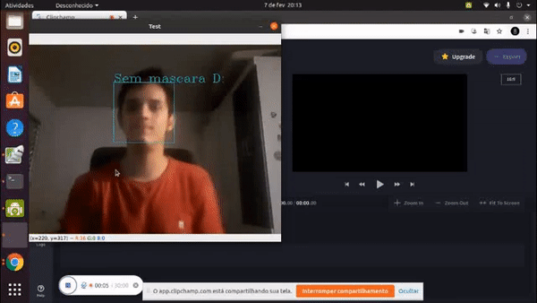

# ia-mask
Inteligencia artificial com capacidade de reconhecimento de imagem em tempo
real para saber se está sendo feito o uso da mascara.

#Foco
O foco desse desenvolvimento foi para aumentar meus conhecimentos em Python,
OpenCV e marchine learning.

#Tecnica usada
Dei preferencia para Arvores de decisões. Uma tecnica mais simples
mais rapida e mais fácil de utilizar, perfeita para tal situação, onde quero fazer uma classificação.

